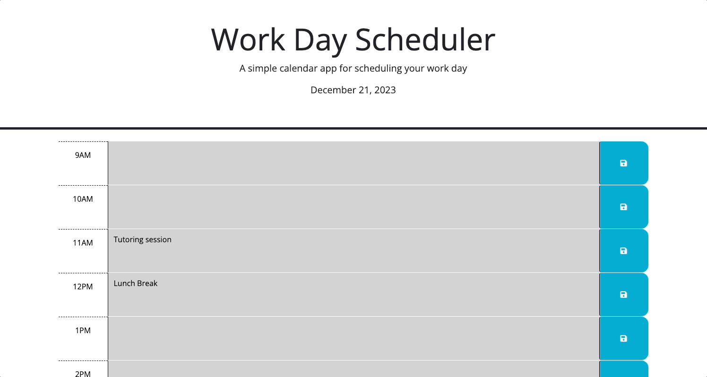

# Work Day Scheduler

## Table of Contents

- [Criteria](#criteria)
- [Overview](#overview)
- [Built With](#built-with)
- [Acknowledgements](#acknowledgements)

## Description
For this project we had to create a simple calendar application that allows a user to save events for each hour of a typical working day by modifying starter code. The app will run in the browser and feature dynamically updated HTML and CSS powered by jQuery.

It was our job to utilise jQuery to build the JavaScript code, as well as expand upon the base CSS and HTML code we were provided with. The [Day.js](https://day.js.org/en/) library was an important tool, essential to working with date and time on this project. 


## Criteria
```md
GIVEN I am using a daily planner to create a schedule
WHEN I open the planner
THEN the current day is displayed at the top of the calendar
WHEN I scroll down
THEN I am presented with timeblocks for standard business hours of 9am-5pm
WHEN I view the timeblocks for that day
THEN each timeblock is color coded to indicate whether it is in the past, present, or future
WHEN I click into a timeblock
THEN I can enter an event
WHEN I click the save button for that timeblock
THEN the text for that event is saved in local storage
WHEN I refresh the page
THEN the saved events persist
```

## Overview
 Overall, this was a small and concise activity, for a simple web application, but still required some trial and error to get to the solution.
 
 It helped me to learn jQuery's syntax, which I was previously unfamilliar with... become more proficcient with the saving and retrieval of locally stored data, as well as navigating Third-Party-API's.
 

### Final Outcome
View my deployed application [here](https://jayabaldwin.github.io/work-day-scheduler/)

The following animation displays the applications functionality:




### Built With
- JavaScript
- HTML
- CSS
- VS Code


## Acknowledgements
- Assistance from my tutor Anastasia Warren
- My classmate, Reid Back, helped me fix the local storage issues I was stuck on
